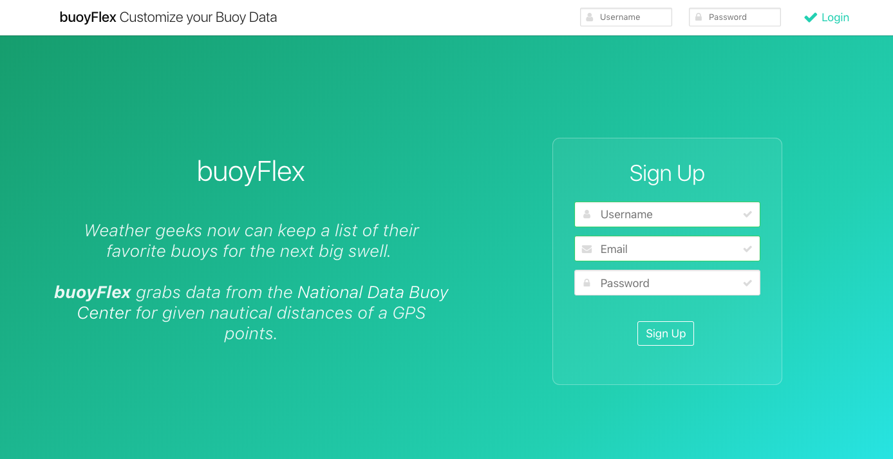
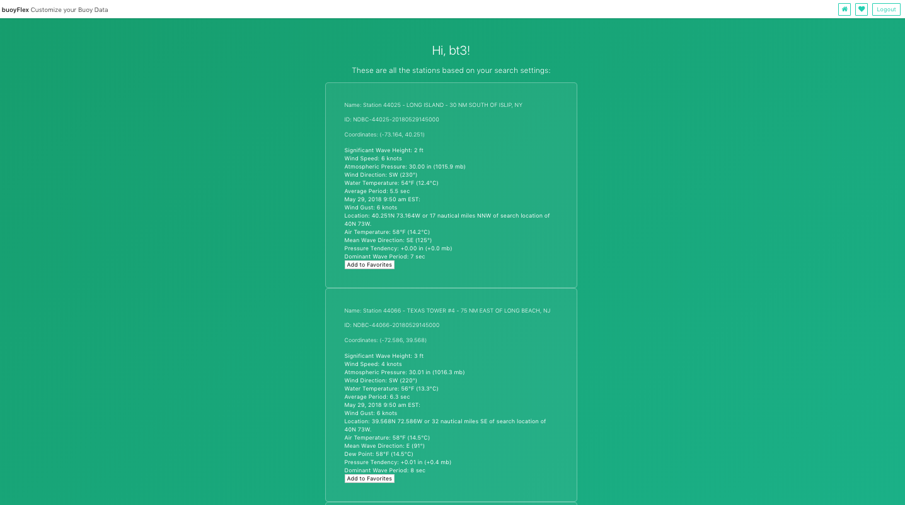
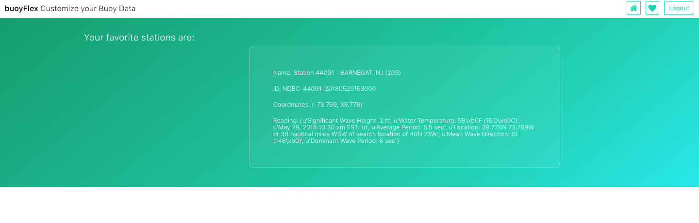

# buoyFlex 🐳

Weather geeks, now you can check all your favorite buoys for the next big swell!

**buoyFlex** lets you customize data served by the **[National Data Buoy Center](http://www.ndbc.noaa.gov/)** so that you can favorite and list your buoy stations.


## Running buoyFlex

### Installing

Create a [virtual environment](https://virtualenv.pypa.io/en/stable/):

```
$ make .venv
$ source .venv/bin/activate
```

Install dependences with [pip](https://pip.pypa.io/en/stable/installing/):

```
$ make install
```

### Configuration

You can configure how buoyFlex runs by editing **config.yaml**.

For instance, you can:

* add your latitude and longitude, and the radius for buoy readings,
* choose to display ships or not,
* change the host and port for the app,
* change the name of the database file.

### Starting

To run buoyFlex:

```
$ make run
```

And open it at your browser at **127.0.0.1:1337** (configurable in the config file as well).


## buoyFlex Features

* Sign up to have a list of buoy readings.



* Fetch the list of stations for your settings.




* Favorite the stations you like.




## Development

There are several features to be implemented in the App. Check the docstrings inside the code to find out more.


----


## License

When making a reference to my work, please use my [website](http://bt3gl.github.io/index.html).
This work is licensed under a [Creative Commons Attribution-ShareAlike 4.0 International License](http://creativecommons.org/licenses/by-sa/4.0/).


